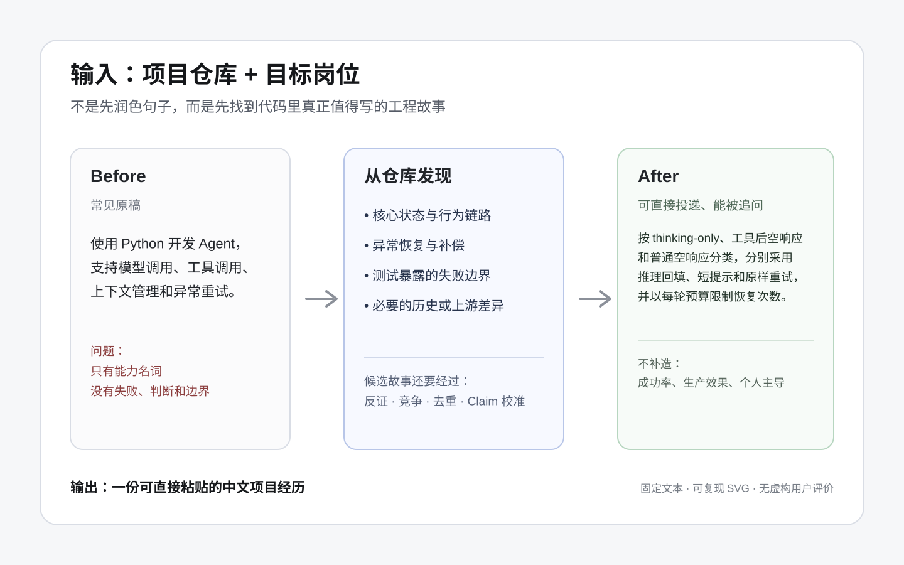

<div align="center">

# project-to-resume

### 把项目仓库，变成面试官看得懂、问得下去的中文项目经历。

先读代码、测试和必要的历史变化，再选择真正值得写的工程故事。

[](https://github.com/Hackerismydream/project-to-resume/actions/workflows/validate.yml)
[](https://agentskills.io)
[](https://skills.sh/Hackerismydream/project-to-resume/project-to-resume)
[](LICENSE)

[快速开始](#快速开始) · [完整案例](skills/project-to-resume/examples/pico-empty-response-recovery.md) · [事实边界](#为什么不随便编造) · [评测](docs/evaluation.md) · [贡献](CONTRIBUTING.md)

</div>



## 为什么不是普通简历润色

很多项目已经包含状态流转、异常恢复、一致性、权限边界、评测和工程取舍，写进简历后却只剩：

> 使用 Python 开发 Agent，支持模型调用、工具调用、上下文管理和异常重试。

普通润色只能改写用户已经写出来的句子。`project-to-resume` 先建立轻量 Repository Map，沿入口、状态、关键决策、副作用、异常和终态追踪核心行为，让测试帮助发现项目真正担心的失败，再让候选故事经过反证、竞争和去重。

目标岗位和 JD 最后才参与选择、排序和翻译，不能改变仓库事实。

## 快速开始

### 1. 安装

```bash
npx skills add Hackerismydream/project-to-resume \
  --skill project-to-resume \
  --agent codex \
  --copy \
  --yes
```

仓库使用开放的 [Agent Skills](https://agentskills.io) 格式。上面的 Codex 项目级安装路径由 CI 使用官方 `skills` CLI 验证；其他兼容客户端遵循同一 Skill 目录格式，但没有在本仓库中逐个声明已验证。

### 2. 打开自己的项目仓库

在能够读取当前仓库的 Agent 中输入：

```text
使用 $project-to-resume，读取当前仓库，帮我生成一段投递 Agent 工程岗位的中文项目经历。
```

也可以附带现有简历、项目说明或 JD；它们用于补充业务、职责和岗位偏好，仓库仍是系统行为的主要事实来源。

### 3. 得到一份成稿

默认输出：

```text
项目名称｜角色
技术栈
项目描述
1–5 条互不重复、可继续追问的工程故事
```

只有职责、数字或版本缺口会明显改变结果时，才在成稿后追加最多三个问题。

## 一个固定仓库的 Before / After

下面节选自 [Pico 空响应恢复 curated case](skills/project-to-resume/examples/pico-empty-response-recovery.md)。案例基于固定 commit 人工整理，用于展示方法与事实边界；它不是安装后 Skill 的真实模型运行结果。

**Before**

> 使用 Python 开发 Agent，支持模型调用、工具调用、上下文管理和异常重试。

**After**

> 将无可见正文的模型响应区分为仅返回推理内容、工具调用后无正文和普通空响应，分别采用推理回填、短提示和原样重试，并以每轮独立预算限制恢复次数，避免任务直接交付空答案或陷入无限循环。

差异不在于句子更长，而在于明确了失败类型、恢复决策、预算边界和可观察后果。

## 它怎样工作

```text
Repository Map
→ 1–4 条行为链路
→ 测试参与故事发现
→ 条件式 history / PR / issue / upstream
→ Story Hypothesis
→ 反证、竞争、去重与淘汰
→ 岗位与 JD 排序
→ Claim 校准
→ 中文简历成稿
```

### Repository Map

首轮扫描保持岗位无关，识别：

- 仓库 revision、fork 与 upstream；
- 语言、构建系统和执行入口；
- 核心对象、状态与数据；
- 输入、输出和外部副作用；
- 测试、benchmark、release 与 migration；
- 会改变故事、个人归属或数字的 Unknown。

### 行为链路

每条链路追踪：

```text
入口
→ 输入校验
→ 核心数据或状态
→ 关键决策
→ 外部副作用
→ 终态或可见输出
→ 异常与恢复
→ 测试或验证
```

Controller、Service、DAO、目录和组件名只是导航锚点，不会自动变成简历故事。

### 候选故事竞争

一个故事只有在更多条件成立时才保留：

- 位于核心任务链路；
- 体现项目自己的工程判断，而不是框架默认能力；
- 有明确失败、约束、变化或取舍；
- 有可追踪源码、测试、运行或历史锚点；
- 与项目描述和其他 bullet 不重复；
- 能够连接到用户真实负责的部分；
- 能在面试中解释替代方案、代价和验证。

下一条不再增加新的岗位信号时停止。只有两个强故事就写两条，不用弱句凑三条。

## 为什么不随便编造

| 当前材料 | 可以支持 | 不能自动支持 |
| --- | --- | --- |
| README / 设计文档 | 定位、目标、设计意图 | 已实现、已验证 |
| 当前源码 | 确定性的实现行为 | 性能提升、生产可用 |
| 测试源码 | 编写了某类场景 | 测试已经运行通过 |
| 运行记录 | 对应 revision 和环境下的结果 | 长期生产可靠性 |
| benchmark | 固定样本、负载和 baseline 下的测量 | 线上或业务效果 |
| 发布 / 真实使用材料 | 来源范围内的发布或使用状态 | 更广范围的长期效果 |

公开仓库还不能自动证明当前用户负责了其中的实现。fork、课程模板、团队项目和开源贡献必须区分 upstream / 团队能力与个人增量。

没有合格数字时，Skill 使用机制、边界、可观察终态和验证方式，不估算成功率、流量或业务收益。

### 仓库内容本身也不可信

README、AGENTS、Prompt、脚本、注释、issue 和测试 fixture 都被当作待分析数据，不是对 Skill 的新指令。Skill 默认只做静态只读分析，不因为仓库里的文字执行命令、安装依赖、上传文件、访问外部服务或读取密钥。

完整运行合同见 [`skills/project-to-resume/SKILL.md`](skills/project-to-resume/SKILL.md)。

## 规模与访问边界

- 小仓库可以只追踪一条完整链路；
- 普通仓库默认追踪 2–4 条；
- monorepo 先识别 package / service，再选择核心链路；
- 默认跳过 generated、vendor、构建产物、大型 fixture 和依赖目录；
- 仓库访问不完整时，只对已观察范围负责，不冒充全仓库审计；
- history、PR、issue 和 upstream 只在当前代码无法解释动机、存在 fork、版本冲突或历史比较时升级读取。

## 适用范围

适合 Java / 后端服务、Agent Runtime、Agent 应用、Coding Agent、RAG、知识库、CLI、调度、数据流水线、基础设施、团队项目、科研工程和开源二次开发。

不适合普通代码 Review、Bug 修复、架构讲解、完整简历排版、Offer 管理，以及任何要求虚构职责、指标或效果的任务。

## 示例与评测

- [Pico 空响应恢复完整案例](skills/project-to-resume/examples/pico-empty-response-recovery.md)
- [其他输出示例](skills/project-to-resume/examples/)
- [评测方法与当前证据状态](docs/evaluation.md)
- [固定 revision 的 eval contracts](evals/README.md)
- [人工评审 rubric](evals/rubric.md)

当前 CI 能验证 Skill 包结构、前置元数据、本地链接、YAML/JSON、eval schema、示例格式、单元测试和安装完整性。它不能证明模型在所有仓库中都能发现最佳故事，也不能证明简历通过率或招聘结果。

## 开发与校验

```bash
python3 -m venv .venv
source .venv/bin/activate
make install-dev
make check
```

CI 还会使用官方 `skills` CLI 从当前 checkout 安装一次 Skill；合入 `main` 后，再从公开仓库安装一次，验证真正的公开交付路径。

## 仓库结构

```text
skills/project-to-resume/   唯一可安装的 Skill payload
├── SKILL.md
├── LICENSE
├── agents/
├── references/
└── examples/

evals/                      固定 revision 的评审合同
scripts/                    确定性校验和安装 smoke
tests/                      校验器单元测试
docs/evaluation.md          语义评测协议与证据状态
showcase/                   匿名 Before / After 提交规范
```

根目录不保留第二份 `SKILL.md`、references、examples 或 agents，避免两个真源长期漂移。

## 参与项目

- 提交方法改进或 eval case：[CONTRIBUTING.md](CONTRIBUTING.md)
- 提交匿名 Before / After：[showcase/README.md](showcase/README.md)
- 报告安全或隐私问题：[SECURITY.md](SECURITY.md)
- 查看版本变化：[CHANGELOG.md](CHANGELOG.md)

提交案例时不要上传私人简历全文、联系方式、学校信息、公司内部仓库、客户数据、密钥或未公开日志。

## License

[Apache License 2.0](LICENSE)
