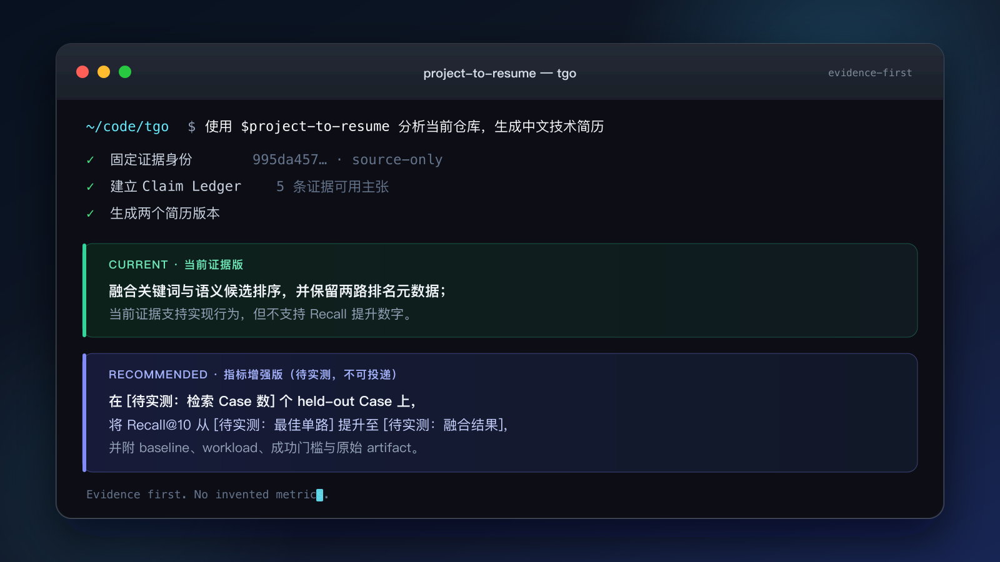

<div align="center">

# Project to Resume

**让 Agent 读懂项目，把仓库证据翻译成面试官能理解的中文技术简历。**

从本地仓库或 GitHub 地址生成项目定位、核心技术与简历要点。<br>
有证据就写结果；没有指标就给测量方案，不编数字。

[](https://github.com/Hackerismydream/project-to-resume/actions/workflows/validate.yml)
[](https://agentskills.io)

</div>



<p align="center"><sub>Demo 内容来自对 TGO 固定 revision 的真实静态审计；界面为可读性重排，未执行目标仓库代码。</sub></p>

## 为什么需要它

项目代码不是简历。类名、模块和 README 宣传不能直接说明你解决了什么问题，也不能证明性能、规模和个人贡献。

Project to Resume 先核对源码、测试、Git 历史与实验记录，再把内部实现翻译成：

> 场景 → 故障 → 可观察行为 → 对照方案 → 结果指标 → 证据边界

最终得到两个版本：

- **当前证据版**：现在已有证据能够支持的项目经历，不含虚构指标。
- **指标增强版**：最值得投递的表达；缺失数字会被标为待实测，并附最小测量方法。在验证完成前明确不可投递。

## Quick start

安装：

```bash
npx skills add Hackerismydream/project-to-resume
```

然后在目标项目中告诉 Agent：

```text
使用 $project-to-resume 分析当前仓库，生成中文技术简历。
```

默认输出当前证据版、指标增强版、指标验证计划和逐条证据边界。

<details>
<summary>手动安装</summary>

Codex：

```bash
git clone https://github.com/Hackerismydream/project-to-resume.git ~/.codex/skills/project-to-resume
```

使用通用 Agent Skills 目录的 Agent：

```bash
git clone https://github.com/Hackerismydream/project-to-resume.git ~/.agents/skills/project-to-resume
```

</details>

## 怎么用

### 分析公开仓库

```text
使用 $project-to-resume 分析 https://github.com/owner/repo，
输出当前证据版和指标增强版中文简历。
```

### 分析本地项目，但不执行代码

```text
使用 $project-to-resume 分析 /path/to/project。
只读取项目，不执行代码；把结果写到 /path/to/output.md。
```

### 核验已有简历

```text
使用 $project-to-resume 核验下面这些项目经历。
逐条判断哪些可以保留、哪些需要降级、哪些指标缺少证据：

[粘贴现有简历]
```

### 根据岗位 JD 调整

```text
使用 $project-to-resume 分析当前仓库，并根据下面的 JD 重排项目要点。
不要改变事实、数字和我的贡献范围：

[粘贴 JD]
```

如果要写成个人简历，请同时提供你的 commit、PR、issue、职责范围或工作记录。只有仓库、没有个人贡献信息时，skill 会先输出以“项目”为主语的项目事实版。

## 真实仓库示例

- [TGO：全渠道 AI Agent 客服平台](examples/tgo.md)
- [Crystal DBA：PostgreSQL 运维 AI Agent](examples/crystaldba.md)
- [TestZeus Hercules：端到端测试 Agent](examples/testzeus-hercules.md)

三份示例都固定到完整 commit，只读取源码和公开元数据，没有把实现存在包装成性能结果。

## 它不会做什么

- 不根据代码规模、测试数量或 README 宣传估算效果指标。
- 不把“存在测试文件”写成“测试已经通过”。
- 不把历史 benchmark、当前源码、发布版本和线上结果混为一谈。
- 不用仓库作者信息推断候选人的个人贡献。

完整工作规则见 [SKILL.md](SKILL.md)，证据规则与输出格式见 [references](references)。
